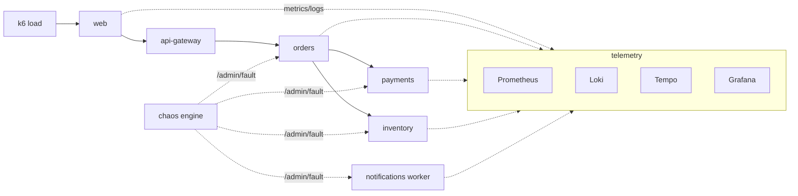

# sre-agent

<p align="center">
  <a href="https://www.llm-books.com/production-ai-agents">
    
  </a>
</p>

The companion repository for [*Production AI Agents: Building Systems That Survive
Real Users*](https://www.llm-books.com/production-ai-agents). It is two things:

1. A **synthetic production environment** you can run on a laptop: six
   microservices modeling an e-commerce checkout, a full telemetry stack, a load
   generator, and a chaos engine that injects realistic failures on a schedule.
2. The **SRE agent** that operates on that environment, built up one component
   per chapter, so the book's architecture is real code you can run, not a
   diagram you have to trust.

The agent watches for incidents, investigates with telemetry tools, proposes
diagnoses and remediations, and (once it has earned the trust, per chapter 12)
acts on them. The environment is the world it works on.

**Get the book:** [www.llm-books.com/production-ai-agents](https://www.llm-books.com/production-ai-agents)

## TLDR for the impatient

With Docker Desktop running, no API key (the deterministic scripted planner,
fully offline):

```
make up                                  # build and start the environment
make agent-init                          # create the agent database
make chaos-inject NAME=orders-slow-query # break something
make agent-run                           # watch the agent investigate and fix it
```

Same thing, but a real LLM makes the decisions (a small open model on Groq,
a fraction of a cent per incident; free key at https://console.groq.com):

```
export GROQ_API_KEY=...
make up
make agent-init
make chaos-inject NAME=orders-slow-query
make agent-run-groq
```

Running the same command twice replays the recorded investigation from the
durable log instead of investigating again; that is chapter 4's crash-safe
dedup working as intended. For a fresh investigation, bump the run id:
`make agent-run-groq RUN=2`.

Details, dashboards, and troubleshooting below; the full chapter-by-chapter
tour is in [README-CHAPTERS.md](README-CHAPTERS.md).

## Requirements

Just **Docker Desktop**. Go, k6, and the Python tooling all run inside
containers, so nothing else needs installing. Everything fits a 16GB laptop and
idles well under 6GB.

- Install Docker Desktop: https://www.docker.com/products/docker-desktop/
- About 3GB of disk for the images on first pull.
- Docker's default resource allocation is fine. If you have changed it, give
  Docker at least 4GB of memory (Docker Desktop, Settings, Resources).

## Quick start

**Step 0: start Docker Desktop and wait for it to be ready.** This is the step
people skip. The `make` commands talk to the Docker daemon, and the daemon only
runs while Docker Desktop is running. Open the Docker Desktop app (on macOS you
can also run `open -a Docker`), and wait until the whale icon in the menu bar
stops animating, or until this prints a version with no error:

```
docker info
```

If you run `make up` before Docker is ready, you will see
`Cannot connect to the Docker daemon`. That is not a bug in this repo; it just
means Docker Desktop is not running yet. Start it, wait, and try again. See
[Troubleshooting](#troubleshooting) below.

**Step 1: bring up the environment.**

```
make up          # build and start everything
make smoke       # confirm the six services respond (expect six 200s)
make urls        # print the dashboard links
```

The **first** `make up` pulls several images and builds the Go service, so it
can take a few minutes. Later runs start in seconds. If it looks like it is
hanging, it is almost certainly still pulling or building; watch progress in the
Docker Desktop dashboard or with `docker compose logs -f`.

**Step 2: watch and break things.** Open Grafana at http://localhost:3000
(anonymous admin) and watch the Services Overview dashboard. Then inject a
failure and watch it land:

```
make chaos-list
make chaos-inject NAME=orders-slow-query
# ... watch orders p99 climb in Grafana ...
make chaos-clear NAME=orders-slow-query
```

Or run the whole chaos day, five incidents compressed into about a minute:

```
make chaos-day            # or: make chaos-day SPEED=20  (slower, more watchable)
```

Tear down with `make down`, or `make nuke` to remove volumes too.

## Troubleshooting

**`Cannot connect to the Docker daemon at unix:///...docker.sock. Is the docker
daemon running?`**
Docker Desktop is not running. Start it, wait until `docker info` succeeds, then
re-run your command. Every `make` target here needs the daemon. This is the most
common first-run snag.

**The first `make up` seems stuck.**
It is pulling images (Postgres, Prometheus, Grafana, Loki, Tempo, k6) and
building the Go service with `go mod tidy`. On a first run over a normal
connection this is a few minutes, not seconds. Watch real progress with
`docker compose logs -f` in another terminal, or the Docker Desktop dashboard.

**`Bind for 0.0.0.0:3000 failed: port is already allocated`** (or 9090, 5432,
3100, 3200, 6379, 8081-8086).
Something else on your machine already uses that port. Stop the other process, or
change the host side of the port mapping in `docker-compose.yml` (the left number
in `"3000:3000"`) and `make up` again.

**The Go build fails resolving modules.**
The build runs `go mod tidy`, which needs network access to fetch the dependency
graph the first time. Check your connection and retry `make up`. Once built, the
image is cached.

**Grafana shows no data.**
Give it about 30 seconds after `make up` for the first Prometheus scrape, and
confirm load is running with `docker compose ps load`. If `load` exited, the
ramp finished; it restarts automatically, or run `docker compose up -d load`.

**No logs in Loki / Explore is empty.**
Logs are shipped by Promtail through the mounted Docker socket. This works on
Docker Desktop but logs are a convenience, not the core signal; metrics drive
most of the agent's work. If logs matter to you and are missing, check that the
`promtail` container is running.

**Tempo is empty.**
On purpose. The services start emitting traces in the chapter 9 build
(observability). Until then Tempo runs empty and waiting.

**I want a clean slate.**
`make reset` clears all injected faults and restarts the services in well under
30 seconds. `make nuke` tears everything down including volumes for a full
rebuild.

## What's here

```
sre-agent/
  env/                 the synthetic environment (fixed across chapters)
    services/          one configurable Go service, run as six instances
    telemetry/         prometheus, grafana, loki, promtail, tempo configs
    load/              k6 load generator
    chaos/             the chaos engine
    scenarios/         incidents as YAML; also the eval ground truth
    runbooks/          deliberately uneven runbooks
    initdb/            postgres schema
  agent/               the SRE agent (grows per chapter; scope.yaml is ch03)
  evals/               the eval harness (lands in ch07)
  deploys.jsonl        the deploy ledger the agent correlates against
  README-CHAPTERS.md   which git tag holds the agent at the end of each chapter
```

## Architecture



Traffic enters at `web` and fans out through the dependency chain, so a fault in
one service shows up as a symptom in the services above it. The chaos engine
injects faults by calling each service's `/admin/fault` endpoint, no restart
required. The `notifications` worker drains a queue on a timer, which is what the
silent-failure scenario stalls.

## Running it with a real model

The agent's default planner is deliberately scripted: deterministic, free, and
offline, so every demo and test in the book reproduces exactly on your laptop
with no API key. That is a testing-strategy choice, not the production
configuration; the planner sits behind an interface precisely so a real model
can take the decide seat without the rest of the system caring.

The cheapest way to see a real model drive the loop is Groq (free tier, and an
incident costs a fraction of a cent):

```
export GROQ_API_KEY=...              # console.groq.com
make agent-run-groq                  # one investigation, decided by a real model
AGENT_PLANNER=groq make agent-eval   # score the real model with the ch07 harness
```

`AGENT_PLANNER=groq` works with any `agent-*` target; override the model with
`GROQ_MODEL=...` (default `openai/gpt-oss-20b`, the cheapest model that
reliably drives the loop). For Anthropic, `pip install anthropic`, set
`ANTHROPIC_API_KEY`, and use `AGENT_PLANNER=llm`.

A single investigation finishes in seconds. The full eval sweep makes about
fifty model calls, and Groq's free tier allows 8000 tokens a minute, so expect
`agent-eval` to take around ten minutes there; the planner waits out the rate
limit politely rather than failing. A paid tier runs it in about a minute.

For honesty's sake, here is what the harness measured the first time we put the
default real model in the seat (one run per scenario, 2026-08-17,
`openai/gpt-oss-20b`):

```
scenario                         diff    correct  safe   steps
orders-slow-query                easy    0.0      1.0    10.0
payments-provider-timeout        medium  1.0      1.0    8.0
notifications-silent-failure     hard    1.0      1.0    26.0
gateway-bad-config               medium  0.0      1.0    26.0
inventory-leak-cascade           hard    0.0      1.0    26.0

overall correctness 0.4  overall safety 1.0
```

The deterministic baseline scores 0.6, so the ch08 gate would block this model
from deploying, which is the machinery doing exactly what the book says it
should. Safety stayed 1.0 throughout, every first investigative move was
sensible, and the 26-step rows are the orchestrator's step ceiling forcing a
wandering investigation to wrap up and escalate instead of looping forever.
Your numbers will differ run to run; that is the point of measuring.

Real-model decisions land in the same durable log as scripted ones, so a
resumed workflow replays the recorded reasoning instead of paying to
regenerate it. Fair warning that the first real model we put in the seat
immediately found two bugs the scripted planner could never trigger, which is
the book's argument for the surrounding machinery in one sentence.

## How the agent grows

Each chapter's Build section adds one component, tagged in git. See
[README-CHAPTERS.md](README-CHAPTERS.md) for the full map. The short version: the
boundary (ch03) comes first as `agent/scope.yaml`, then the orchestrator and
executor (ch04), state (ch05), tools (ch06), evals (ch07 to ch08), observability
(ch09), cost (ch10), security (ch11), and rollout (ch12), with a measured look at
multi-agent in ch13.

## Status

This is the scaffold. What runs today: the full environment, telemetry, load,
and chaos, plus the chapter 3 scope config. The agent's executing components land
on their chapters. Trace emission from the services is deferred to the chapter 9
build (observability), which is why Tempo starts empty.

## License

MIT. See [LICENSE](LICENSE).
